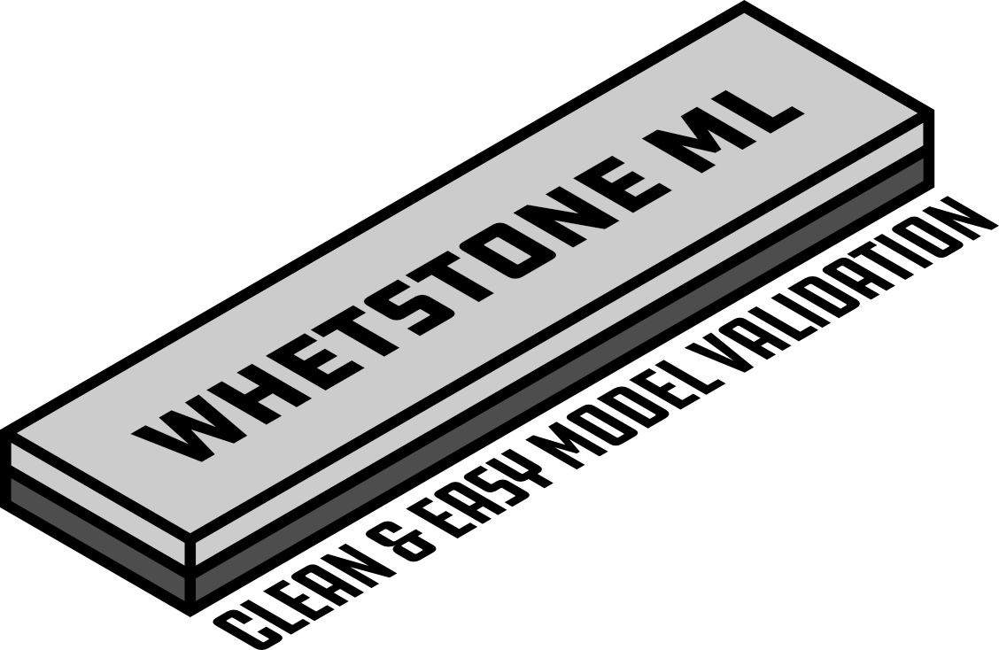

   

# Whetstone ML

## What is Whetstone ML?
The name for this library is inspired by the [real life stone object](https://en.wikipedia.org/wiki/Sharpening_stone) designed to keep knives sharp. When a knife becomes dull, a whetstone is used to revitalize its sharpness so that the knife may continue to be used in an optimal manner. Because data tends to drift over time, machine learning (ML) models running in a production environment may experience degradation in the form of model drift. Like a whetstone helps to keep knives sharp, Whetstone ML is a free, open-source Python library designed to assist data science practitioners with validating that ML models running in a production environment continue to perform at an optimal level.